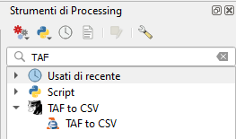
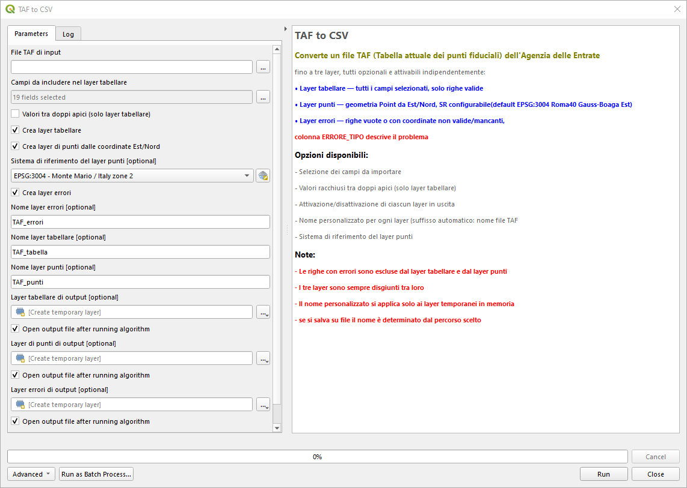
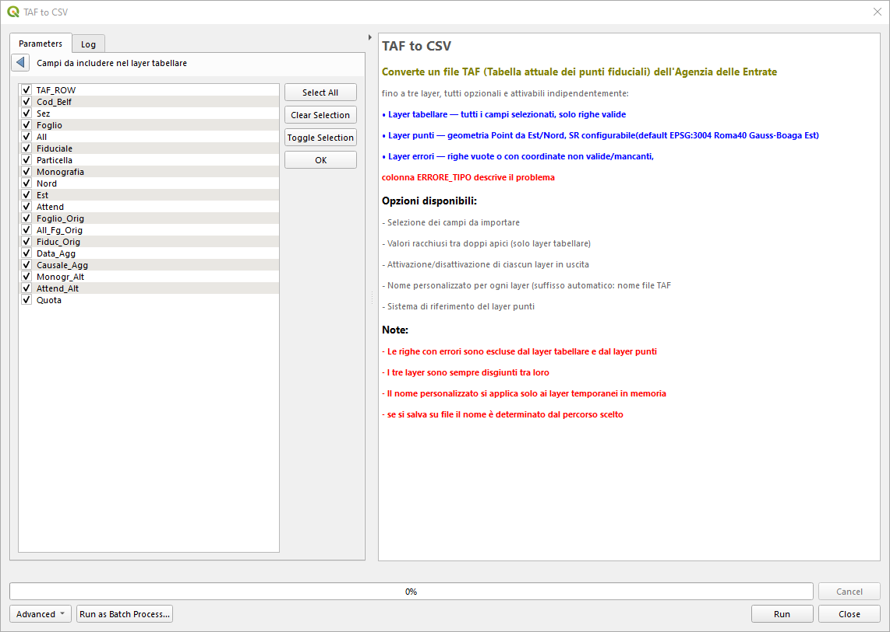
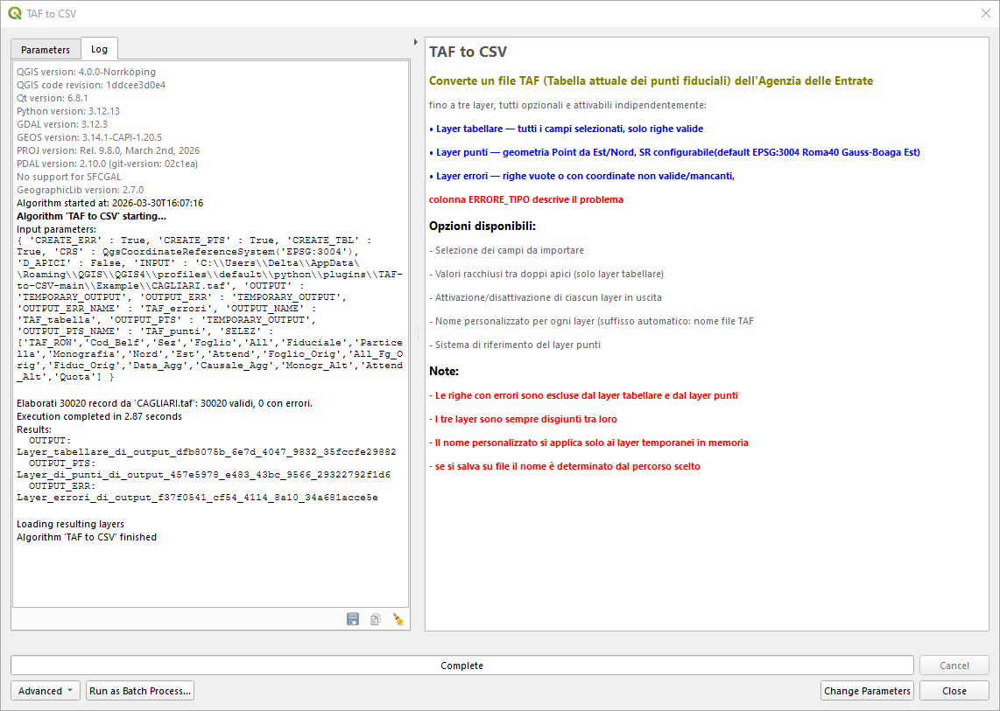

# TAF-to-CSV
Converte una Tabella attuale dei punti fiduciali (Taf) dell'Agenzia delle Entrate in un file csv standard (encoding UTF8 e separatore la '`,`')  aggiungendo le opportune intestazioni

### Installazione

Per installarlo basta che scarichiate lo zip del repo e da QGIS fate installa plugin da zip. Spero a breve sia disponibile nel repository ufficiale di QGIS.

### Finestra processing
Il plugin, una volta caricato, compare negli script di processing nella cartella 'TAF to CSV'.

Una volta avviato inserire il file da convertire ed eventualmente il file di destinazione.

E' possibile deselezionare tra i campi disponibili (19 selezionati di default) quelli non desiderati e la loro eventuale riorganizzazione per trascinamento.

Una volta selezionati i campi di interesse e avviato il plugin si otterranno tre layer temporanei.
Uno con dati tabellari, uno con gli errori tabellati ed ul layer di punti georeferenziato.
Il layer di punti potrebbe dare risultati inaspettati a causa di diversi formati di coordinate presenti nel TAF.
Sono tutti opzionali e possono essere salvati nel formato preferito.

### Update 29.03.2026
Aggiunta forma tabellare dei risultati e layer di rappresentazione.

### Update 23.05.2021
Aggiunto copia risultato su clipboard, ora, sempre dopo aver eseguito, il percorso è già disponibile nella clipboard: basta incollare direttamente nella finestra di caricamento file '**Data Source Manager - Testo Delimitato**' e cancellare manualmente l'ultimo spazio dal percorso.

### Riferimenti
Le specifiche di codifica dei file TAF dell'Agenzia delle Entrate sono disponibili qui
https://wwwt.agenziaentrate.gov.it/servizi/Monografie/taf/tracciato_taf.pdf

### Blogpost

https://pigrecoinfinito.com/2021/05/17/file-csv-a-larghezza-fissa/

https://pigrecoinfinito.com/2021/05/18/qgis-come-leggere-file-csv-fixed/

### Ringraziamenti
[QGIS.org](https://www.qgis.org/it/site/) - [Totò Fiandaca](https://pigrecoinfinito.com/) -  [Andrea Borruso](https://twitter.com/aborruso)